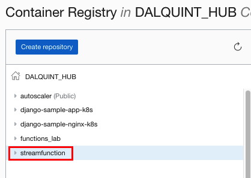
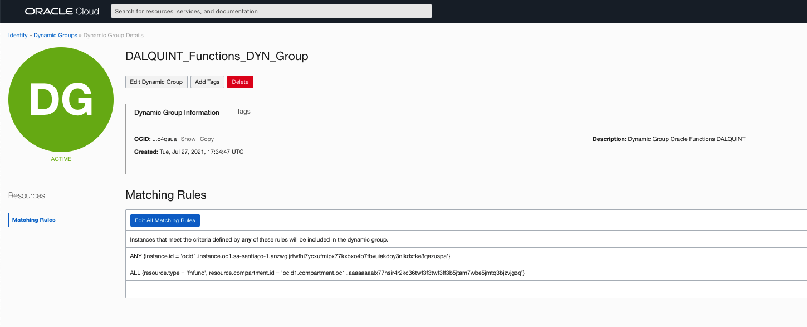
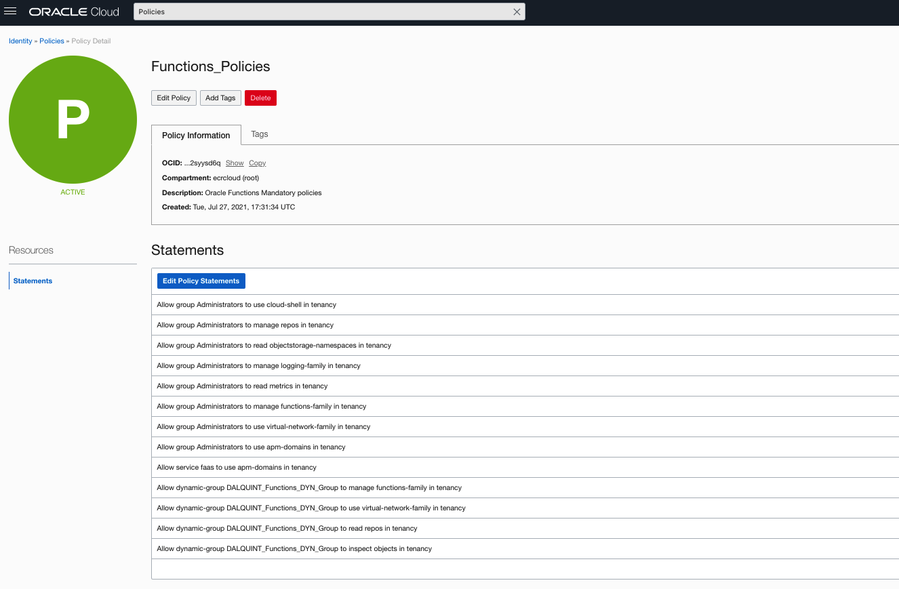
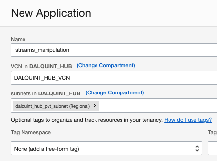
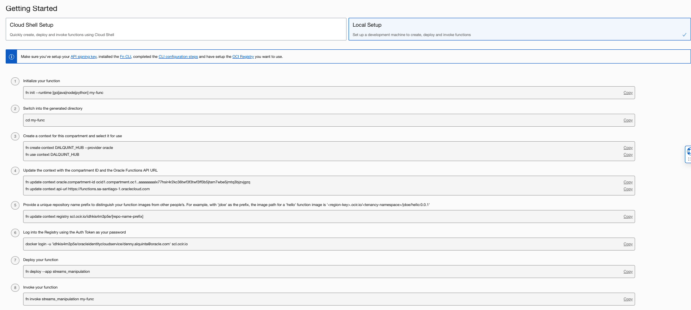

# serverless_streams
This repository contains a PoC for creating and manipulating streams using Oracle Functions

## Creation steps: 

1. Create a virtual environment to have your function code and dependencies installed. 


```shell
opc@dalquintdevhubscl serverless_streams]$ mkvirtualenv cli-app
created virtual environment CPython3.6.8.final.0-64 in 516ms
  creator CPython3Posix(dest=/home/opc/envs/cli-app, clear=False, no_vcs_ignore=False, global=False)
  seeder FromAppData(download=False, pip=bundle, setuptools=bundle, wheel=bundle, via=copy, app_data_dir=/home/opc/.local/share/virtualenv)
    added seed packages: certifi==2021.5.30, configparser==4.0.2, oci==2.43.1, pip==21.1.3, pip==21.2.4, pyOpenSSL==19.1.0, pycparser==2.20, python_dateutil==2.8.2, pytz==2021.1, setuptools==57.1.0, setuptools==57.4.0, six==1.16.0, wheel==0.36.2, wheel==0.37.0
  activators BashActivator,CShellActivator,FishActivator,PowerShellActivator,PythonActivator,XonshActivator
```

2. Create a repository on OCIR



3. If not already done so, create an authentication token in your user

4. Create the following policies and dynamic group



The instance OCID is the ocid of the compute where you're running the pivot server and FN CLI
The compartment OCID, is the ocid of the compartment where the function will be created



5. Go to Developer Services > Functions and create an app. In this case streams_manipulation. Something like this will appear.




6. Run the following commands to init and push the image into OCIR: 

```shell
(cli-app) [opc@dalquintdevhubscl serverless_streams]$ fn init --runtime python streams_manipulation_poc
Creating function at: ./streams_manipulation_poc
Function boilerplate generated.
func.yaml created.
(cli-app) [opc@dalquintdevhubscl serverless_streams]$ cd streams_manipulation_poc/
(cli-app) [opc@dalquintdevhubscl streams_manipulation_poc]$ fn create context DALQUINT_HUB --provider oracle

Fn: Context already exists

See 'fn <command> --help' for more information. Client version: 0.6.8
(cli-app) [opc@dalquintdevhubscl streams_manipulation_poc]$ fn use context DALQUINT_HUB
Now using context: DALQUINT_HUB 
(cli-app) [opc@dalquintdevhubscl streams_manipulation_poc]$ fn update context oracle.compartment-id ocid1.compartment.oc1..aaaaaaaalx77hsir4r2kc36twf3f3twf3ff3b5jtam7wbe5jmtq3bjzvjgzq
Current context updated oracle.compartment-id with ocid1.compartment.oc1..aaaaaaaalx77hsir4r2kc36twf3f3twf3ff3b5jtam7wbe5jmtq3bjzvjgzq
(cli-app) [opc@dalquintdevhubscl streams_manipulation_poc]$ fn update context api-url https://functions.sa-santiago-1.oraclecloud.com
Current context updated api-url with https://functions.sa-santiago-1.oraclecloud.com
(cli-app) [opc@dalquintdevhubscl streams_manipulation_poc]$ fn update context registry scl.ocir.io/idhkis4m3p5e/streamfunction
Current context updated registry with scl.ocir.io/idhkis4m3p5e/streamfunction
```

6. Login into OCIR

```shell
(cli-app) [opc@dalquintdevhubscl streams_manipulation_poc]$ docker login -u 'idhkis4m3p5e/oracleidentitycloudservice/denny.alquinta@oracle.com' scl.ocir.io
Password: YOUR_TOKEN_PASSWORD
WARNING! Your password will be stored unencrypted in /home/opc/.docker/config.json.
Configure a credential helper to remove this warning. See
https://docs.docker.com/engine/reference/commandline/login/#credentials-store

Login Succeeded
```


7. Make sure the file requirements.txt looks like this: 

```shell
fdk>=0.1.44
oci>=2.2.18
```

8. Deploy the function: 

```shell
(cli-app) [opc@dalquintdevhubscl serverless_streams]$ cd streams_manipulation_poc
(cli-app) [opc@dalquintdevhubscl streams_manipulation_poc]$ fn deploy --app streams_manipulation
Deploying streams_manipulation_poc to app: streams_manipulation
Bumped to version 0.0.2
Building image scl.ocir.io/idhkis4m3p5e/streamfunction/streams_manipulation_poc:0.0.2 ..............................................................
Parts:  [scl.ocir.io idhkis4m3p5e streamfunction streams_manipulation_poc:0.0.2]
Pushing scl.ocir.io/idhkis4m3p5e/streamfunction/streams_manipulation_poc:0.0.2 to docker registry...The push refers to repository [scl.ocir.io/idhkis4m3p5e/streamfunction/streams_manipulation_poc]
908b16eedbbf: Pushed 
c2898e83373d: Pushed 
ad2bc7a168b9: Pushed 
97bdde477c05: Pushed 
55ea01058c36: Pushed 
457cec018f55: Pushed 
e57f007acf74: Pushed 
0.0.2: digest: sha256:671ed1a77ccc405a0e4dbf29402ed42758678c4d10b08133f910af4a388728fe size: 1780
Updating function streams_manipulation_poc using image scl.ocir.io/idhkis4m3p5e/streamfunction/streams_manipulation_poc:0.0.2...
Successfully created function: streams_manipulation_poc with scl.ocir.io/idhkis4m3p5e/streamfunction/streams_manipulation_poc:0.0.2
```

# Setting up the code

1. Set up the policies required to make the streams work. These are: 

```shell
Allow group Administrators to manage streams in tenancy
Allow group Administrators to manage stream-pull in tenancy
Allow group Administrators to manage stream-push in tenancy
```

2. Collect the following details: 

- Stream OCID
- Messages endpoint
- Stream pool OCID
- Stream pool FQDN
- Kafka connection settings:
- Bootstrap servers
- SASL connection strings
- Security protocol

Follow this documentation for more details: https://docs.oracle.com/en/cloud/paas/integration-cloud/stream-service-adapter/prerequisites-creating-connection.html

3. To create the certificate run: 
   
echo -n | openssl s_client -connect cqijnemmtooa.streaming.sa-santiago-1.oci.oraclecloud.com:9092 | sed -ne  '/-BEGIN CERTIFICATE-/,/-END CERTIFICATE-/p' > ociStreaming.cert 
keytool -keystore streaming_truststore.jks -alias OSSStream -import -file ociStreaming.cert